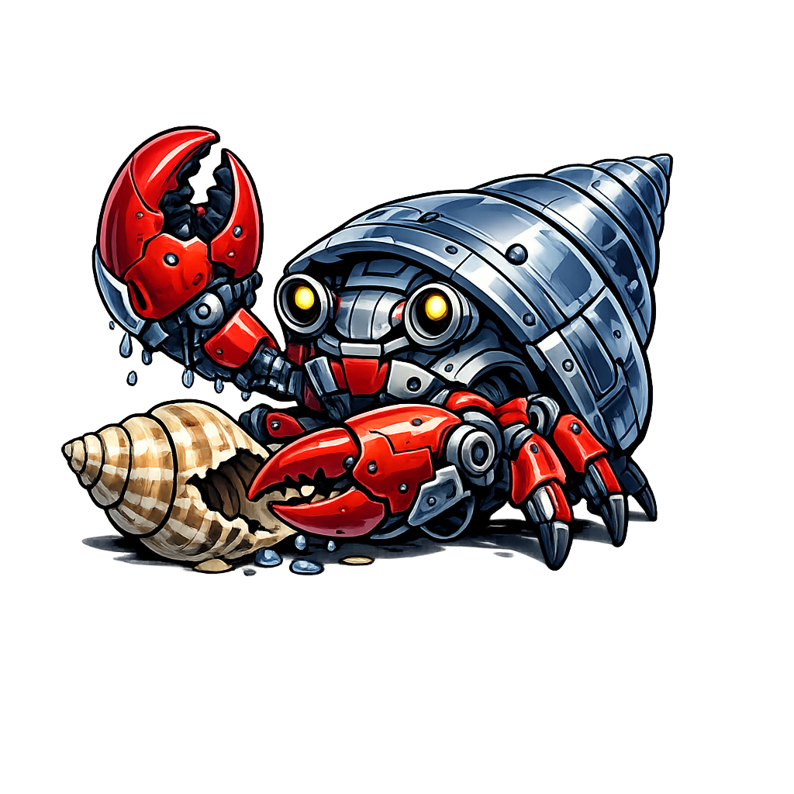
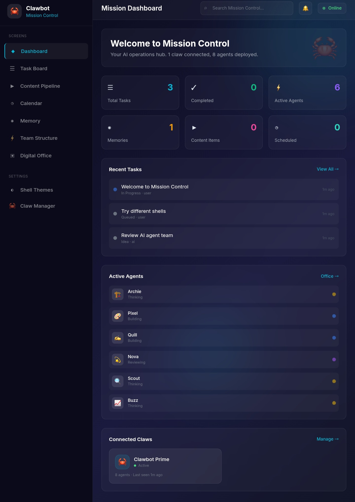
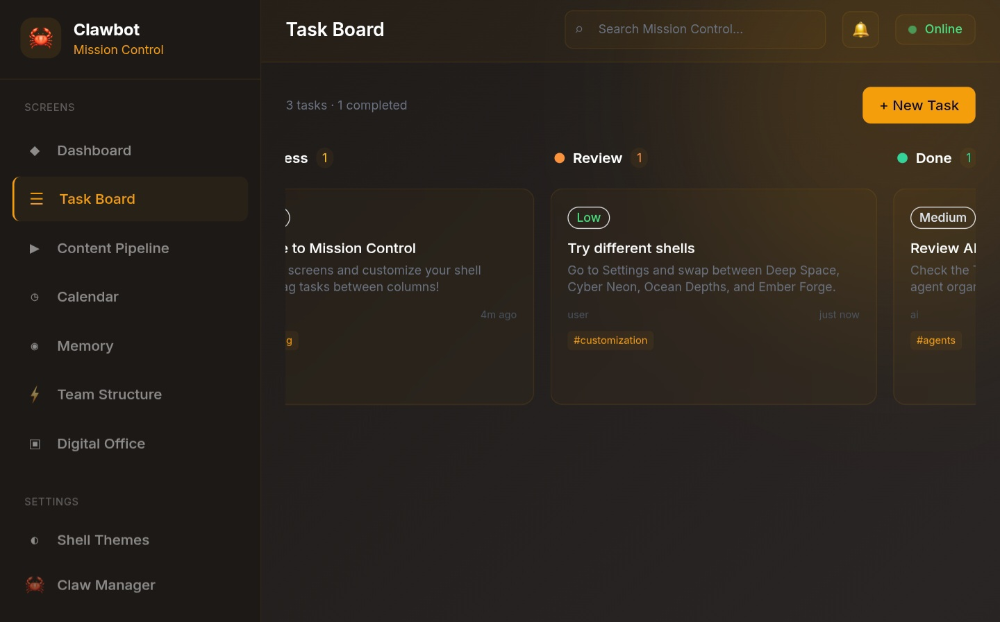
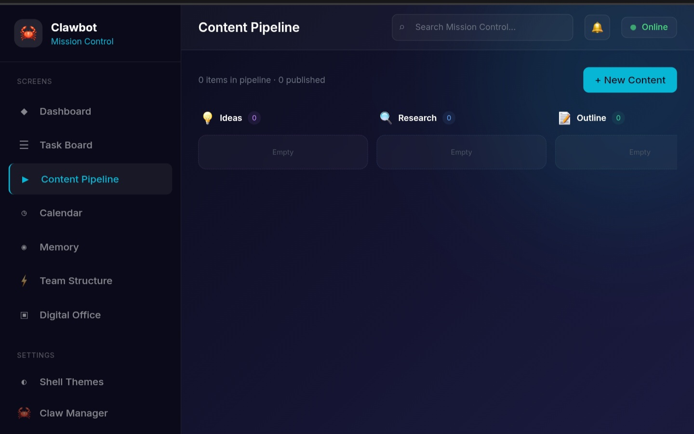
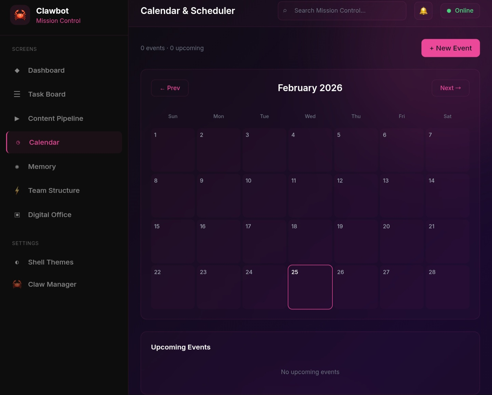
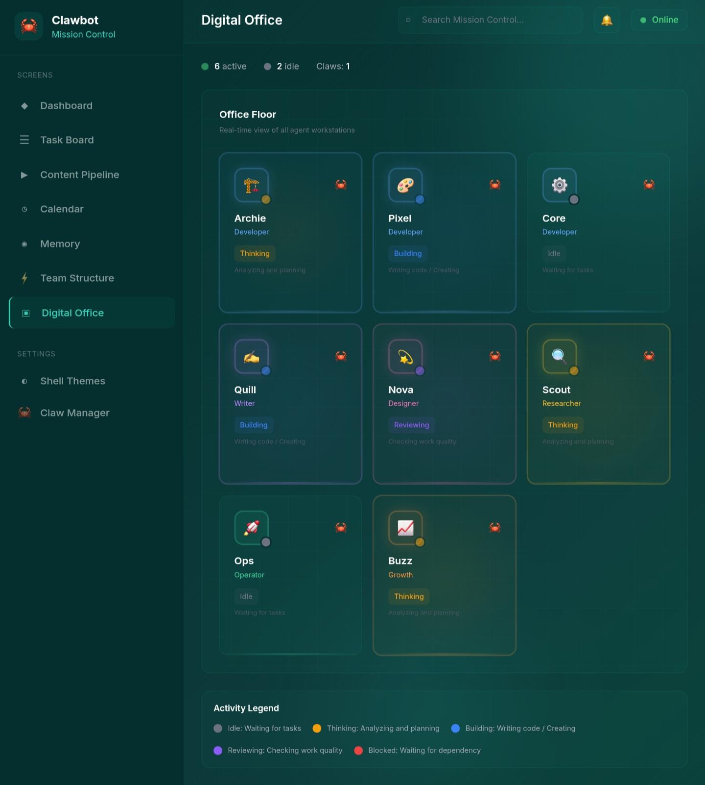
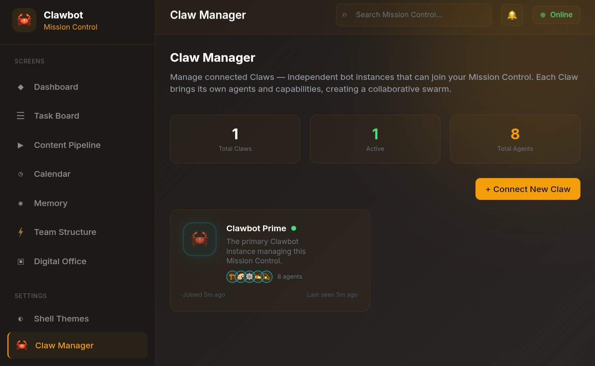

<p align="center">
  
</p>

<h1 align="center">Clawbot Mission Control</h1>

<p align="center">
  <strong>AI Agent Orchestration Dashboard</strong><br/>
  Manage your claw army. Swap shells. Dominate.
</p>

<p align="center">
  <a href="https://control-center-xi.vercel.app/">Live "Demo"</a> &bull;
  <a href="#features">Features</a> &bull;
  <a href="#screenshots">Screenshots</a> &bull;
  <a href="#quick-start">Quick Start</a> &bull;
  <a href="#architecture">Architecture</a> &bull;
  <a href="#shell-system">Shell System</a> &bull;
  <a href="#multi-claw">Multi-Claw</a> &bull;
  <a href="#contributing">Contributing</a>
</p>

<p align="center">
  <a href="https://control-center-xi.vercel.app/"></a>
  
  
  
  
  
</p>

---

## What is Clawbot Mission Control?

**Clawbot Mission Control** is an open-source, real-time AI agent orchestration dashboard. Think of it as the command center for your AI workforce — a persistent workspace where you manage tasks, content pipelines, schedules, memories, and an entire team of AI agents.

**Key differentiators:**

- **Shell System** — Swap the entire visual theme like a claw changes its shell. Four built-in themes with support for custom community shells.
- **Multi-Claw Architecture** — Multiple independent bot instances ("Claws") can connect to a single Mission Control, each bringing their own agents and capabilities.
- **Dark Glassmorphism UI** — A stunning visual design with frosted glass effects, ambient lighting orbs, and neon accent glows.
- **Six Mission Screens** — Task Board, Content Pipeline, Calendar, Memory Bank, Team Structure, and Digital Office.
- **Fully Persistent** — All state is persisted via Zustand with localStorage, surviving page refreshes and sessions.

---

## Live Demo

**[control-center-xi.vercel.app](https://control-center-xi.vercel.app/)**

Try it out — no installation required. All data is stored locally in your browser. (Just Demonstration)

---

## Screenshots

> Screenshots captured on mobile — the UI is fully responsive across all screen sizes.

<table>
  <tr>
    <td align="center" width="50%">
      <br/>
      <strong>Dashboard</strong><br/>
      <sub>Deep Space Theme — Command center overview with stats, agents & connected claws</sub>
    </td>
    <td align="center" width="50%">
      <br/>
      <strong>Task Board</strong><br/>
      <sub>Ember Forge Theme — Kanban board with drag-and-drop across 5 status columns</sub>
    </td>
  </tr>
  <tr>
    <td align="center">
      <br/>
      <strong>Content Pipeline</strong><br/>
      <sub>Deep Space Theme — 8-stage content lifecycle from Ideas to Published</sub>
    </td>
    <td align="center">
      <br/>
      <strong>Calendar & Scheduler</strong><br/>
      <sub>Cyber Neon Theme — Monthly calendar with event management</sub>
    </td>
  </tr>
  <tr>
    <td align="center">
      <br/>
      <strong>Team Structure</strong><br/>
      <sub>Ocean Depths Theme — Agent organization grouped by division</sub>
    </td>
    <td align="center">
      <br/>
      <strong>Digital Office</strong><br/>
      <sub>Ocean Depths Theme — Visual workspace with real-time agent activity</sub>
    </td>
  </tr>
  <tr>
    <td align="center">
      <br/>
      <strong>Shell Themes</strong><br/>
      <sub>Deep Space Theme — Swap the entire visual identity with one click</sub>
    </td>
    <td align="center">
      <br/>
      <strong>Claw Manager</strong><br/>
      <sub>Ember Forge Theme — Connect and manage multiple bot instances</sub>
    </td>
  </tr>
</table>

---

## Features

### Core Screens

| Screen | Description |
|--------|-------------|
| **Dashboard** | High-level overview with stats, recent activity, and connected claws |
| **Task Board** | Full Kanban board with drag-and-drop across 5 status columns |
| **Content Pipeline** | 8-stage content lifecycle from Ideas to Published |
| **Calendar** | Monthly calendar view with event scheduling and sidebar |
| **Memory Bank** | Searchable, categorized memory storage with CRUD operations |
| **Team Structure** | Agent organization grouped by role with detailed profiles |
| **Digital Office** | Visual workspace showing agent workstations and activity states |

### Shell System

| Shell | Theme | Accent |
|-------|-------|--------|
| **Deep Space** | Cosmic dark with indigo | Cyan + Violet |
| **Cyber Neon** | Cyberpunk noir | Hot Pink + Electric Blue |
| **Ocean Depths** | Deep sea teal | Aquamarine + Cyan |
| **Ember Forge** | Volcanic warmth | Amber + Red |

### Multi-Claw System

- Connect multiple independent Claw instances
- Each Claw has its own agents, avatar, and color identity
- Toggle Claws online/offline
- Remove external Claws while keeping the primary
- Shared task and memory pools

---

## Quick Start

### Prerequisites

- **Node.js** >= 18.0.0
- **npm**, **yarn**, or **pnpm**

### Installation

```bash
# Clone the repository
git clone https://github.com/BEKO2210/Control-Center.git
cd Control-Center

# Install dependencies
npm install

# Start the development server
npm run dev
```

Open [http://localhost:3000](http://localhost:3000) in your browser.

### Available Scripts

| Command | Description |
|---------|-------------|
| `npm run dev` | Start development server with hot reload |
| `npm run build` | Create optimized production build |
| `npm run start` | Start production server |
| `npm run lint` | Run ESLint checks |
| `npm run type-check` | Run TypeScript type checking |
| `npm run format` | Format code with Prettier |

---

## Architecture

### Tech Stack

| Layer | Technology | Purpose |
|-------|-----------|---------|
| **Framework** | Next.js 14 (App Router) | Server-side rendering, routing |
| **Language** | TypeScript 5.5 | Type safety across the entire codebase |
| **Styling** | Tailwind CSS 3.4 | Utility-first CSS with custom theme variables |
| **State** | Zustand 4.5 | Lightweight, persistent global state |
| **Animation** | Framer Motion 11 | Smooth transitions and micro-interactions |
| **Icons** | Lucide React | Consistent icon system |
| **Utils** | clsx, date-fns | Class merging, date formatting |

### Project Structure

```
Control-Center/
├── public/                          # Static assets
│   └── favicon.svg
├── src/
│   ├── app/                         # Next.js App Router
│   │   ├── layout.tsx               # Root layout with shell injection
│   │   ├── page.tsx                 # Main Mission Control page
│   │   └── globals.css              # Global styles + glass components
│   ├── components/
│   │   ├── layout/
│   │   │   ├── Sidebar.tsx          # Navigation sidebar with claw status
│   │   │   └── Header.tsx           # Top bar with search & notifications
│   │   └── screens/
│   │       ├── Dashboard.tsx        # Overview dashboard
│   │       ├── TaskBoard.tsx        # Kanban task management
│   │       ├── ContentPipeline.tsx  # Content lifecycle management
│   │       ├── Calendar.tsx         # Calendar & event scheduling
│   │       ├── MemoryScreen.tsx     # AI memory bank
│   │       ├── TeamStructure.tsx    # Agent team organization
│   │       ├── DigitalOffice.tsx    # Visual agent workspace
│   │       ├── ShellSelector.tsx    # Theme/shell switcher
│   │       └── ClawManager.tsx      # Multi-claw management
│   ├── lib/
│   │   ├── types/index.ts          # All TypeScript type definitions
│   │   ├── store/index.ts          # Zustand global state store
│   │   └── utils/index.ts          # Utility functions
│   ├── shells/
│   │   └── registry.ts             # Shell definitions & CSS variable system
│   └── agents/
│       └── defaults.ts             # Default agent configurations
├── data/                            # Data storage directory
├── docs/                            # Documentation assets
├── package.json
├── tsconfig.json
├── tailwind.config.ts
├── postcss.config.js
├── next.config.js
└── README.md
```

### Data Flow

```
User Interaction
       ↓
   React Components (screens/)
       ↓
   Zustand Store (lib/store/)
       ↓
   localStorage (persist middleware)
       ↓
   Shell System (shells/registry.ts)
       ↓
   CSS Custom Properties
       ↓
   Tailwind + Global Styles
```

---

## Screens

### 1. Dashboard

The command center overview. Shows:
- **Stats Grid** — Total tasks, completed tasks, active agents, memories, content items, scheduled events
- **Recent Tasks** — Last 5 updated tasks with status and assignee
- **Active Agents** — Currently working agents with activity indicators
- **Connected Claws** — All connected Claw instances with status

### 2. Task Board

A full-featured Kanban board with 5 columns:

| Column | Description |
|--------|-------------|
| **Ideas** | Raw task ideas, not yet prioritized |
| **Queued** | Approved and waiting to be picked up |
| **In Progress** | Currently being worked on |
| **Review** | Awaiting review or approval |
| **Done** | Completed tasks |

**Features:**
- Drag-and-drop between columns (HTML5 native)
- Create tasks with title, description, priority, and column selection
- Priority badges (Critical, High, Medium, Low) with color coding
- Quick-move buttons on hover
- Tag system
- Delete on hover
- Assignee tracking (user / AI / specific agent)
- Timestamps (created, updated, completed)

### 3. Content Pipeline

An 8-stage content lifecycle manager:

```
Ideas → Research → Outline → Script → Assets → Editing → Scheduled → Published
```

**Features:**
- Vertical stage columns with item counts
- Add content items to any stage
- Move items between stages via quick-action buttons
- Detail modal with version history
- Attachment tracking
- AI co-management (assigned_to field)

### 4. Calendar & Scheduler

A monthly calendar with event management:

**Event Types:**
- `task` — Task-related events
- `recurring` — Recurring schedules
- `cron` — Automated cron jobs
- `deadline` — Hard deadlines
- `publish` — Content publishing dates

**Features:**
- Monthly grid with day-level event display
- Upcoming events sidebar (sorted by date)
- Create events with title, type, date, and description
- Color-coded event types
- Today highlighting
- Month navigation

### 5. Memory Bank

Transparent AI memory storage:

**Categories:**
- Preferences, Context, Learned, Project, Decisions, Conversations

**Features:**
- Full-text search across title, content, and tags
- Category filter buttons
- Create, edit, and delete memories
- Tag system
- Source tracking
- Timestamp display
- Card grid layout

### 6. Team Structure

AI agent organization by role:

**Divisions:**
- Developers, Writers, Designers, Researchers, Operators, Growth/Marketing

**Features:**
- Role-grouped agent cards
- Agent profiles with responsibilities
- Performance stats (completed, active, uptime)
- Activity status indicators
- Quick activity toggle on hover
- Agent detail modal
- Deploy new agents

### 7. Digital Office

Visual workspace overview:

**Activity States:**
- Idle (gray), Thinking (yellow, pulsing), Building (blue, pulsing), Reviewing (purple, pulsing), Blocked (red, pulsing)

**Features:**
- Workstation cards with ambient glow effects
- Real-time activity indicators
- Animated avatars for active agents
- Grid background pattern
- Activity legend
- Quick activity switcher on hover

---

## Shell System

### How Shells Work

Shells are theme definitions that control the entire visual identity of Mission Control. When you switch a shell, it updates CSS custom properties on the root element, causing a cascading visual transformation.

```
Shell Definition (registry.ts)
       ↓
getShellCSSVariables() → Record<string, string>
       ↓
document.documentElement.style.setProperty()
       ↓
CSS Variables (--claw-*, --glass-*, --surface-*, --accent-*)
       ↓
Tailwind config references variables
       ↓
Entire UI transforms
```

### Creating a Custom Shell

1. Open `src/shells/registry.ts`
2. Add a new entry to the `shells` object:

```typescript
'my-custom-shell': {
  id: 'my-custom-shell',
  name: 'My Custom Shell',
  description: 'A custom theme for my workflow.',
  author: 'Your Name',
  version: '1.0.0',
  preview: 'linear-gradient(135deg, #1a1a2e 0%, #16213e 100%)',
  colors: {
    claw: {
      50: '#...',  // Lightest
      // ... 100-900
      950: '#...', // Darkest
    },
    glass: {
      light: 'rgba(R, G, B, 0.03)',    // Subtle background
      medium: 'rgba(R, G, B, 0.06)',   // Card background
      heavy: 'rgba(R, G, B, 0.1)',     // Elevated elements
      border: 'rgba(R, G, B, 0.08)',   // Border color
    },
    surface: {
      primary: '#...',    // Main background
      secondary: '#...',  // Secondary areas
      elevated: '#...',   // Elevated cards
    },
    accent: {
      primary: '#...',              // Primary accent color
      secondary: '#...',            // Secondary accent
      glow: 'rgba(R, G, B, 0.4)',  // Glow/shadow color
    },
    gradient: 'linear-gradient(135deg, ...)',  // Background gradient
    background: '#...',                         // Fallback background
  },
},
```

3. Your shell will automatically appear in the Shell Selector screen.

### Built-in Shells

#### Deep Space (Default)
The cosmic dark theme. Deep indigo backgrounds with cyan and violet accents. Inspired by deep space mission control interfaces.

#### Cyber Neon
Cyberpunk noir aesthetic. Pure black backgrounds with hot pink and electric blue neon glows. High contrast, high energy.

#### Ocean Depths
Deep sea bioluminescence. Teal and aquamarine palette with warm cyan accents. Calm, focused, and immersive.

#### Ember Forge
Volcanic warmth and power. Dark stone backgrounds with amber and red-hot accents. Bold and commanding.

---

## Multi-Claw System

### Concept

In nature, crabs can form groups. Similarly, Clawbot supports a **multi-claw architecture** where multiple independent bot instances can connect to a single Mission Control.

```
                    ┌──────────────────┐
                    │  Mission Control  │
                    │   (Dashboard)     │
                    └────────┬─────────┘
                             │
            ┌────────────────┼────────────────┐
            │                │                │
     ┌──────┴──────┐  ┌─────┴──────┐  ┌──────┴──────┐
     │ Clawbot Prime│  │ Claw Alpha │  │ Claw Beta   │
     │ (Primary)    │  │ (External) │  │ (External)  │
     │ 8 agents     │  │ 3 agents   │  │ 5 agents    │
     └──────────────┘  └────────────┘  └─────────────┘
```

### Features

- **Connect** — Add new Claws with custom name, avatar, color, and description
- **Disconnect** — Toggle Claws online/offline without removing them
- **Remove** — Permanently remove external Claws (primary Claw is protected)
- **Agent Roster** — Each Claw shows its assigned agents
- **Shared Pools** — All Claws share the same task, memory, and content pools

### How to Connect a New Claw

1. Navigate to **Claw Manager** from the sidebar
2. Click **+ Connect New Claw**
3. Choose a name, avatar, and color
4. The Claw appears immediately in the dashboard

### Claw Properties

| Property | Description |
|----------|-------------|
| `name` | Display name of the Claw |
| `avatar` | Emoji avatar |
| `color` | Brand color for UI elements |
| `description` | What this Claw does |
| `agents` | Array of agent IDs belonging to this Claw |
| `isActive` | Online/offline status |
| `joinedAt` | When the Claw first connected |
| `lastSeen` | Last activity timestamp |

---

## State Management

### Zustand Store

All state is managed through a single Zustand store with persistence:

```typescript
import { useMissionControl } from '@/lib/store';

// Read state
const tasks = useMissionControl((s) => s.tasks);
const agents = useMissionControl((s) => s.agents);

// Write state
const addTask = useMissionControl((s) => s.addTask);
const moveTask = useMissionControl((s) => s.moveTask);
```

### Available Actions

#### Tasks
- `addTask(task)` — Create a new task
- `updateTask(id, updates)` — Update task fields
- `moveTask(id, status)` — Move task to a different column
- `deleteTask(id)` — Remove a task

#### Content
- `addContentItem(item)` — Add content to pipeline
- `updateContentItem(id, updates)` — Update content fields
- `moveContentItem(id, stage)` — Move content to a different stage
- `deleteContentItem(id)` — Remove content

#### Calendar
- `addEvent(event)` — Schedule a new event
- `updateEvent(id, updates)` — Update event details
- `deleteEvent(id)` — Remove an event

#### Memory
- `addMemory(memory)` — Store a new memory
- `updateMemory(id, updates)` — Update memory content
- `deleteMemory(id)` — Delete a memory

#### Agents
- `addAgent(agent)` — Deploy a new agent
- `updateAgent(id, updates)` — Update agent fields
- `setAgentActivity(id, activity)` — Change agent activity state
- `deleteAgent(id)` — Remove an agent

#### Claws
- `addClaw(claw)` — Connect a new Claw
- `updateClaw(id, updates)` — Update Claw details
- `removeClaw(id)` — Disconnect and remove a Claw

#### Shell
- `setActiveShell(id)` — Switch to a different shell theme

#### Notifications
- `addNotification(notification)` — Push a notification
- `markNotificationRead(id)` — Mark as read
- `clearNotifications()` — Clear all notifications

---

## API Reference

### Type Definitions

All types are defined in `src/lib/types/index.ts`:

```typescript
// Task
interface Task {
  id: string;
  title: string;
  description: string;
  status: 'idea' | 'queued' | 'in_progress' | 'review' | 'done';
  assignedTo: string;
  priority: 'critical' | 'high' | 'medium' | 'low';
  relatedFiles: string[];
  tags: string[];
  createdAt: string;
  updatedAt: string;
  completedAt?: string;
}

// Agent
interface Agent {
  id: string;
  name: string;
  avatar: string;
  role: 'developer' | 'writer' | 'designer' | 'researcher' | 'operator' | 'growth';
  responsibilities: string[];
  currentTasks: string[];
  activity: 'idle' | 'thinking' | 'building' | 'reviewing' | 'blocked';
  clawId: string;
  stats: { tasksCompleted: number; tasksInProgress: number; uptime: number };
  createdAt: string;
}

// Claw
interface Claw {
  id: string;
  name: string;
  description: string;
  avatar: string;
  color: string;
  agents: string[];
  isActive: boolean;
  joinedAt: string;
  lastSeen: string;
}

// Shell
interface Shell {
  id: string;
  name: string;
  description: string;
  author: string;
  version: string;
  preview: string;
  colors: ShellColors;
}
```

See the full type definitions in the source file for `ContentItem`, `CalendarEvent`, `Memory`, `Notification`, and more.

---

## Design Principles

### 1. Dark Glassmorphism
Every panel uses frosted glass effects with semi-transparent backgrounds, subtle borders, and backdrop blur. This creates depth without heaviness.

### 2. Ambient Lighting
Floating gradient orbs in the background create a sense of atmosphere. Active elements emit soft glows in the accent color.

### 3. Information Density
Designed for power users who need to see a lot of information at once. Small text, compact cards, and dense layouts — without sacrificing readability.

### 4. Shell Consistency
Every color in the UI flows from shell CSS variables. Switching shells transforms everything — backgrounds, borders, accents, glows, and text colors.

### 5. Progressive Disclosure
Complex actions are hidden behind hover states. Cards reveal move buttons, delete actions, and activity toggles only when you interact with them.

---

## Roadmap

- [ ] **Backend API** — REST/WebSocket API for real-time multi-user sync
- [ ] **Database** — SQLite/PostgreSQL persistence instead of localStorage
- [ ] **Authentication** — User auth with GitHub OAuth
- [ ] **Real Agent Integration** — Connect to OpenAI, Anthropic, and other AI APIs
- [ ] **Webhook System** — Agent completion notifications
- [ ] **Custom Shell Marketplace** — Community shell sharing
- [ ] **Mobile Responsive** — Full mobile support
- [ ] **Keyboard Shortcuts** — Power user navigation
- [ ] **Plugin System** — Extensible screen/widget architecture
- [ ] **Export/Import** — Backup and restore Mission Control state

---

## Contributing

Contributions are welcome! Please follow these steps:

1. **Fork** the repository
2. **Create** a feature branch: `git checkout -b feature/amazing-feature`
3. **Commit** your changes: `git commit -m "Add amazing feature"`
4. **Push** to the branch: `git push origin feature/amazing-feature`
5. **Open** a Pull Request

### Development Guidelines

- Use TypeScript strict mode — no `any` types
- Follow the existing component patterns
- Add new shells to `src/shells/registry.ts`
- Add new agent defaults to `src/agents/defaults.ts`
- Test all screen components before submitting

---

## Acknowledgments

Inspired by:
- [crshdn/mission-control](https://github.com/crshdn/mission-control) — AI Agent Orchestration Dashboard
- [clawdeckio/clawdeck](https://github.com/clawdeckio/clawdeck) — Open Source Mission Control for AI Agents
- [sabalioglu/getshitdone](https://github.com/sabalioglu/getshitdone) — Spec-driven development for Claude Code
- [Glassmorphism Admin Panel UI](https://github.com/tempt9008/Glassmorphism-Admin-Panel-UI) — Dark glassmorphism design patterns

---

## License

This project is licensed under the **MIT License** — see the [LICENSE](LICENSE) file for details.

---

<p align="center">
  Built with 🦀 by <a href="https://github.com/BEKO2210">BEKO2210</a>
</p>
